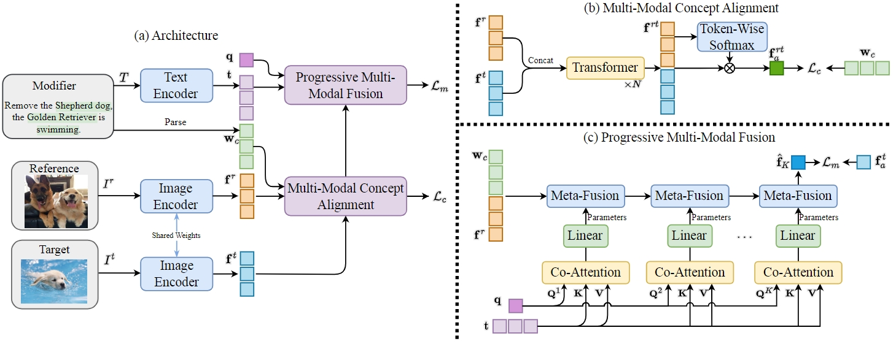

# NEUCORE code release

This repository contains the code release of NEUCORE, from our paper: 

[**NEUCORE: Neural Concept Reasoning for Composed Image Retrieval**](https://arxiv.org/pdf/2310.01358.pdf) 
Shu Zhao, Huijuan Xu. 
UniReps Workshop @ Neural Information Processing Systems, 2023.

If this code and/or paper is useful in your research, please cite:

```bibtex
@article{zhao2023neucore,
  title={NEUCORE: Neural Concept Reasoning for Composed Image Retrieval},
  author={Zhao, Shu and Xu, Huijuan},
  journal={arXiv preprint arXiv:2310.01358},
  year={2023}
}
```

## Architecture



## Preparations

### Environment

Create the environment for running our code as follow:

```bash
conda create --name neucore python=3.8
conda activate neucore
pip install -r requirements.txt
```

**Note:** using cuda version 11.1 (please modify `requirements.txt` otherwise)

### Datasets

Please refer to [ARTEMIS](https://github.com/naver/artemis) repo to prepare datasets.

Datasets should be put into `data` folder.

Extract concepts from sentences by NLTK: 
```bash
python scripts/extract_concepts_<dataset>.py
```

## Training
```
sh ./scripts/train.sh <dataset>
```

## Evaluation

Pre-trained model: [google drive](https://drive.google.com/drive/folders/1hjpn8Fn_pj_8-p129FWZBneg9QVTTWeN?usp=sharing)

```
sh ./scripts/test.sh <dataset> <checkpoint_path>
```
